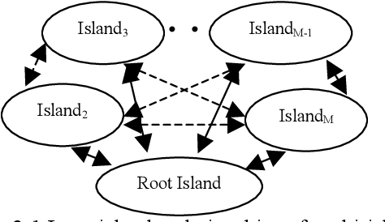
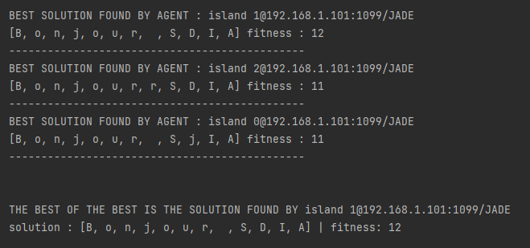
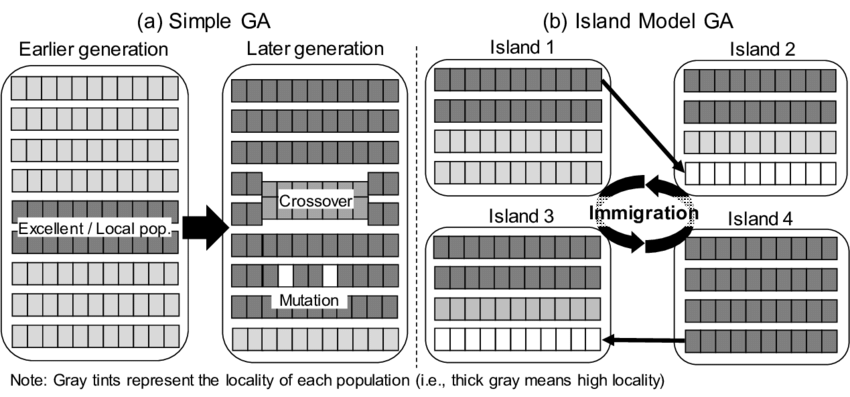

# 🧬 Genetic Algorithm using Jade Framework (2 models)
#
# PART 1 : Genetic Algorithm (N° population = N° agents)

## Introduction

This project demonstrates the implementation of a genetic algorithm using the Jade framework. The purpose of this project is to showcase the application of genetic algorithms in solving optimization problems.

## Project Description

The project focuses on solving a specific optimization problem using a genetic algorithm. The optimization problem can be defined as finding the best solution (chromosome) that satisfies a given set of constraints. In this case, the problem is to find the closest approximation to a target solution.

## Genetic Algorithm

The genetic algorithm is a metaheuristic optimization algorithm inspired by the process of natural selection and genetics. It mimics the principles of biological evolution to find optimal solutions to complex problems.

The algorithm starts with an initial population of potential solutions (individuals) represented by chromosomes. Each chromosome encodes a potential solution to the problem. The genetic algorithm then iteratively performs selection, crossover, and mutation operations on the population to evolve and improve the solutions over generations.

### Selection
Selection is the process of choosing individuals from the current population to create the next generation. The selection is typically based on the fitness of each individual, where individuals with higher fitness have a higher chance of being selected.

### Crossover
Crossover involves combining genetic material from two parent individuals to create offspring individuals. It mimics the reproduction process in nature. Crossover is performed at specific points in the chromosomes, exchanging segments of genetic material between parents to create new solutions.

### Mutation
Mutation introduces random changes in the genetic material of individuals to maintain diversity in the population. It helps explore new areas of the search space and prevents premature convergence to suboptimal solutions.

The genetic algorithm continues iterating through the selection, crossover, and mutation operations until a termination condition is met, such as reaching a maximum number of iterations or finding a satisfactory solution.

## Results and Analysis

Upon running the genetic algorithm, the console output will provide information about each generation's fitness values and the best solution found. Analyzing the results, you can observe how the algorithm converges towards the optimal solution.

The execution visualizes the algorithm's performance, showcasing the fitness values across iterations. This visualization can help understand the convergence and efficiency of the genetic algorithm.

# PART 2 : Genetic Algorithm (island model)

The Island Model is a parallel implementation of a genetic algorithm where multiple subpopulations, known as islands, evolve independently and occasionally exchange individuals or information with each other. This approach is inspired by the idea of isolated populations on islands that can undergo their own evolutionary processes but can also interact with other populations when necessary.

In the Island Model, each island represents a separate subpopulation with its own set of individuals. The islands evolve independently by applying genetic operators such as selection, crossover, and mutation to their individuals. This allows each island to explore a different part of the search space and potentially find different solutions.

Overall, the Island Model is a powerful technique in genetic algorithms that combines the benefits of exploration and exploitation through the parallel evolution of multiple subpopulations.

## Results

# Comparison

The comparison between the Island Model and the model where the number of populations equals the number of agents can be summarized as follows:

<ul>
<li>Parallelism and Efficiency: </li>
<ol>
<li>Island Model: The Island Model inherently provides parallelism by allowing the independent evolution of multiple subpopulations on different islands.</li>
<li>Model with Number of Populations = Number of Agents: While this model also allows for parallel processing, the lack of interaction between populations limits the potential benefits of parallelism.</li>
</ol>
<li>Population Structure: </li>
<ol>
<li>Island Model: In the Island Model, the populations are divided into separate islands, with each island representing a subpopulation. The islands evolve independently and can have different sizes or configurations.</li>
<li>Model with Number of Populations = Number of Agents: In this model, each agent represents a separate population. The populations are not connected or interacting with each other.</li>
</ol>
</ul>

## Conclusion

Implementing this genetic algorithm using the Jade framework has allowed me to gain practical experience in solving optimization problems. Through this project, I have developed a solid understanding of genetic algorithms and their application in various domains.

I hope this project demonstrates my comprehension of genetic algorithms and highlights my ability to apply them to real-world problems. Thank you for reviewing my work.

